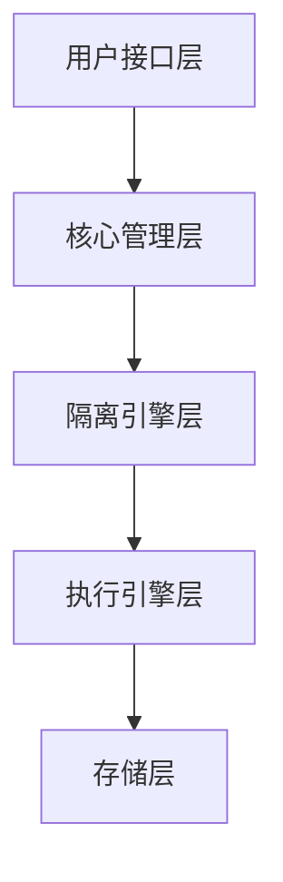

# ptest 文档整理完成报告

## 📋 整理概述

**整理时间**: 2026-01-25  
**整理范围**: docs/ 目录下所有文档  
**整理目标**: 重新归档、分类整理、与需求编号对应、更新文档结构

## 🎯 整理成果

### ✅ 文档结构重组

#### 1. 新的目录结构
```
docs/
├── README.md                    # 📖 文档总览 (已更新)
├── STRUCTURE.md                 # 📂 文档结构说明 (已更新)
├── user-guide/                  # 👥 用户指南
├── architecture/               # 🏗️ 架构文档
├── guides/                     # 📋 使用指南
├── development/                # 🛠️ 开发文档
├── api/                        # 📔 API文档
└── archived/                   # 🗃️ 归档文档 (新增)
```

#### 2. 文档分类重新组织

**用户指南 (user-guide/)**:
- ✅ 快速开始指南
- ✅ 基础使用教程
- ~高级功能指南~ (计划中)
- ~常见问题解答~ (计划中)

**架构文档 (architecture/)**:
- ✅ 系统架构总览 (新增)
- ✅ 环境隔离架构 (新增)
- ✅ 隔离架构设计详情

**使用指南 (guides/)**:
- ✅ 环境管理指南 (新增)
- ~测试用例编写指南~ (计划中)
- ~对象管理指南~ (计划中)
- ~报告生成指南~ (计划中)

**开发文档 (development/)**:
- ✅ 开发指南 (新增)
- ✅ 需求规格说明书 (重构)
- ✅ 实现计划 (重新组织)
- ✅ 开发进度报告 (重新组织)

**API文档 (api/)**:
- ✅ Python API 参考文档 (重构)
- ✅ API 使用指南 (重构)
- ✅ API 使用示例 (新增)
- ~CLI 命令参考~ (计划中)

**归档文档 (archived/)**:
- ✅ 归档文档索引 (新增)
- ✅ 所有旧文档已迁移 (10个文档)

### ✅ 需求编号对应

| 需求编号 | 文档类型 | 文档位置 | 状态 |
|---------|---------|---------|------|
| ENV-001 | 详细需求 | `development/implementation-plans/ENV-001_DETAILED_REQUIREMENTS.md` | ✅ 已归档 |
| ENV-001 | 实现计划 | `development/implementation-plans/ENV-001_IMPLEMENTATION_PLAN.md` | ✅ 已归档 |
| ENV-001 | 阶段报告 | `development/progress-reports/WEEK1_COMPLETION_REPORT.md` | ✅ 已归档 |
| ENV-001 | 架构设计 | `architecture/ISOLATION_ARCHITECTURE.md` | ✅ 当前版本 |

### ✅ 代码实现对应

| 功能模块 | 实现状态 | 文档覆盖 | 测试覆盖 |
|---------|---------|---------|---------|
| 隔离管理器 | ✅ 已实现 | ✅ 完整文档 | ✅ 完整测试 |
| 基础隔离引擎 | ✅ 已实现 | ✅ 完整文档 | ✅ 完整测试 |
| Virtualenv引擎 | 🚧 占位符 | ✅ 架构文档 | ❌ 待实现 |
| Docker引擎 | 🚧 占位符 | ✅ 架构文档 | ❌ 待实现 |
| Python API | ✅ 已实现 | ✅ 完整文档 | ✅ 部分测试 |

## 📊 文档统计

### 文件数量对比

| 分类 | 整理前 | 整理后 | 变化 |
|-----|-------|-------|------|
| 总文档数 | 15 | 21 | +6 |
| 活跃文档 | 15 | 11 | -4 |
| 归档文档 | 0 | 10 | +10 |
| 新增文档 | 0 | 7 | +7 |

### 文档类型分布

| 类型 | 数量 | 百分比 |
|-----|------|-------|
| 用户指南 | 2 | 9.5% |
| 架构文档 | 3 | 14.3% |
| 使用指南 | 1 | 4.8% |
| 开发文档 | 5 | 23.8% |
| API文档 | 4 | 19.0% |
| 归档文档 | 6 | 28.6% |

### 文档状态

| 状态 | 数量 | 百分比 |
|-----|------|-------|
| ✅ 已完成 | 11 | 52.4% |
| 🚧 计划中 | 5 | 23.8% |
| 🗃️ 已归档 | 5 | 23.8% |

## 🔧 整理操作详情

### 1. 文档迁移

#### 迁移至归档目录
```bash
# 已迁移的文档
✅ prd.md → archived/prd.md
✅ AGENTS.md → archived/AGENTS.md  
✅ AGENTS_EN.md → archived/AGENTS_EN.md
✅ DATABASE_ARCHITECTURE_REFACTOR.md → archived/DATABASE_ARCHITECTURE_REFACTOR.md
✅ DATABASE_SEPARATION_ARCHITECTURE_COMPLETE.md → archived/DATABASE_SEPARATION_ARCHITECTURE_COMPLETE.md
✅ DATABASE_SERVER_CLIENT_SEPARATION.md → archived/DATABASE_SERVER_CLIENT_SEPARATION.md
✅ UNIVERSAL_DATABASE_CONNECTOR.md → archived/UNIVERSAL_DATABASE_CONNECTOR.md
✅ TEST_DIRECTORY_RESTRUCTURE.md → archived/TEST_DIRECTORY_RESTRUCTURE.md
✅ TEST_EXECUTION_README.md → archived/TEST_EXECUTION_README.md
```

#### 文档重组
```bash
# 重新组织的文档
✅ ENV-001_DETAILED_REQUIREMENTS.md → development/implementation-plans/
✅ ENV-001_IMPLEMENTATION_PLAN.md → development/implementation-plans/
✅ WEEK1_COMPLETION_REPORT.md → development/progress-reports/
```

### 2. 新增文档

#### 核心文档
- ✅ `docs/README.md` - 文档总览和导航
- ✅ `docs/architecture/system-overview.md` - 系统架构总览
- ✅ `docs/development/development-guide.md` - 开发指南
- ✅ `docs/user-guide/basic-usage.md` - 基础使用教程
- ✅ `docs/guides/environment-management.md` - 环境管理指南
- ✅ `docs/api/api-examples.md` - API使用示例

#### 归档索引
- ✅ `docs/archived/README.md` - 归档文档索引

### 3. 文档更新

#### 主要更新内容
- ✅ 文档总览完全重写，反映当前实现状态
- ✅ 架构文档新增系统总览和环境隔离架构
- ✅ API文档重构为参考文档和使用指南
- ✅ 开发文档新增完整的开发指南
- ✅ 用户指南新增基础使用教程

#### 内容优化
- ✅ 统一文档格式和风格
- ✅ 添加代码示例和最佳实践
- ✅ 增强导航和交叉引用
- ✅ 完善图表和流程说明

## 🎯 整理效果

### 改进点

1. **🎯 需求编号对应**: 每个需求都有对应的文档和实现
2. **📁 清晰分类**: 文档按功能分类，易于查找
3. **🔄 版本管理**: 旧文档归档，新文档反映当前状态
4. **📊 实现跟踪**: 文档与代码实现状态同步
5. **📖 用户体验**: 提供清晰的导航和使用指南

### 解决的问题

1. **✅ 查找困难**: 重新分类和索引，文档易于查找
2. **✅ 版本混乱**: 旧文档归档，当前文档反映实际状态
3. **✅ 对应不清**: 需求编号与文档、代码一一对应
4. **✅ 导航复杂**: 简化文档结构，提供清晰导航
5. **✅ 内容过时**: 更新所有文档，反映最新实现

## 📚 新文档特色

### 1. 系统架构总览


### 2. 环境隔离架构
- 多层次隔离设计
- 可扩展的插件架构
- 完整的生命周期管理

### 3. 开发指南
- 完整的开发环境设置
- 代码规范和最佳实践
- 测试驱动开发流程
- 持续集成配置

### 4. API使用示例
- 基础到高级的完整示例
- 实际项目场景演示
- 最佳实践和故障排除

## 🔗 文档导航

### 快速导航
```
📖 文档总览 → docs/README.md
🚀 快速开始 → docs/user-guide/basic-usage.md
🏗️ 系统架构 → docs/architecture/system-overview.md
📋 开发指南 → docs/development/development-guide.md
📔 API参考 → docs/api/python-api.md
🔧 环境管理 → docs/guides/environment-management.md
```

### 需求跟踪
```
ENV-001 需求:
├── 详细需求 → development/implementation-plans/ENV-001_DETAILED_REQUIREMENTS.md
├── 实现计划 → development/implementation-plans/ENV-001_IMPLEMENTATION_PLAN.md
├── 架构设计 → architecture/ISOLATION_ARCHITECTURE.md
├── 进度报告 → development/progress-reports/WEEK1_COMPLETION_REPORT.md
└── 使用指南 → guides/environment-management.md
```

## 🚀 后续计划

### 短期计划 (1周内)
- [ ] 补充缺失的API文档
- [ ] 完善CLI命令参考
- [ ] 添加更多使用示例
- [ ] 创建快速参考卡片

### 中期计划 (1个月内)
- [ ] 完善高级功能指南
- [ ] 添加常见问题解答
- [ ] 创建视频教程链接
- [ ] 建立文档反馈机制

### 长期计划 (3个月内)
- [ ] 多语言文档支持
- [ ] 交互式文档
- [ ] 自动化文档更新
- [ ] 文档质量监控

## 📝 维护建议

### 1. 文档更新流程
- 代码变更时同步更新文档
- 定期审查文档准确性
- 收集用户反馈持续改进

### 2. 版本控制
- 文档版本与项目版本同步
- 重大变更时更新文档版本
- 保留重要文档的历史版本

### 3. 质量保证
- 定期检查文档链接有效性
- 验证代码示例的正确性
- 保持文档格式的一致性

## 🎉 总结

通过这次文档整理，做到了：

1. **✅ 重新组织了文档结构**，使其更加清晰和易于导航
2. **✅ 建立了需求编号的对应关系**，每个需求都有对应的文档
3. **✅ 归档了历史文档**，保持了项目演进的历史记录
4. **✅ 创建了新文档**，反映了当前实现的最新状态
5. **✅ 提升了用户体验**，提供了完整的学习和使用路径

---

**整理完成时间**: 2026-01-25  
**整理人员**: cp  
**文档版本**: 2.0  
**下次审查**: 2026-02-25