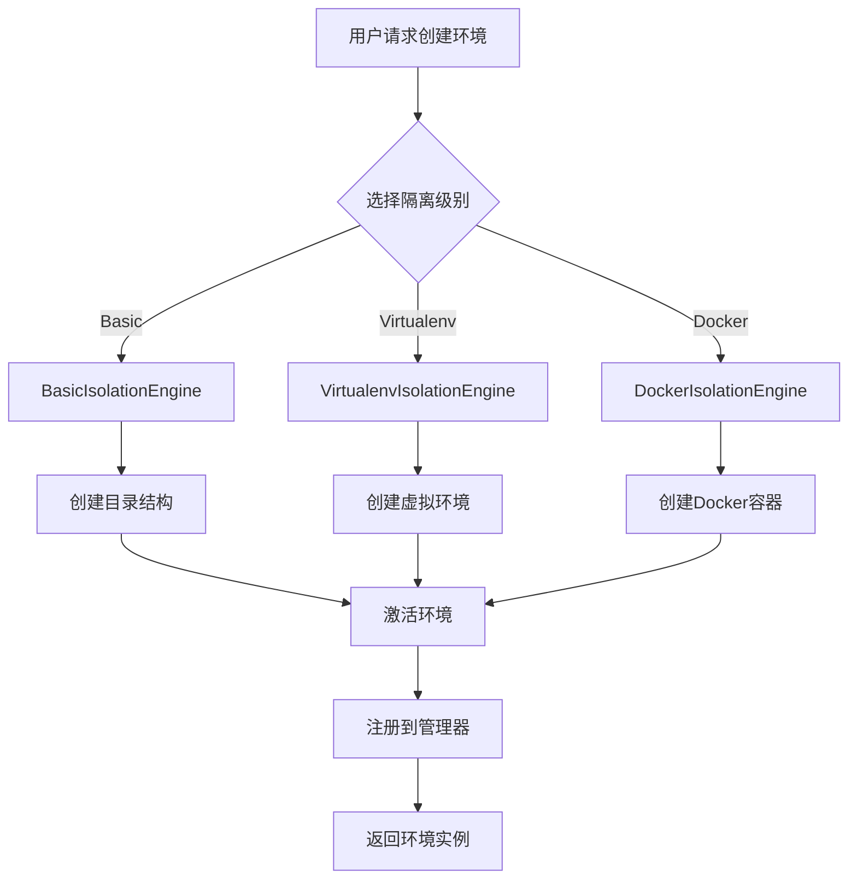
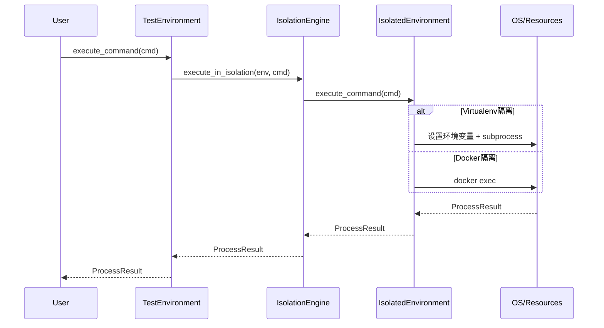
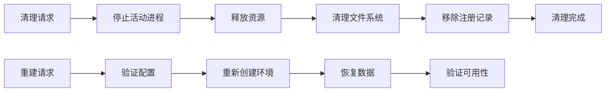

# 环境隔离架构设计

## 🎯 隔离架构概述

环境隔离架构是 ptest 框架的核心能力之一，提供多层次的环境隔离保障，确保测试环境之间的完全独立性和安全性。

### 设计目标

1. **完全隔离**: 环境间无任何相互影响
2. **可扩展性**: 支持多种隔离技术和策略
3. **高性能**: 低延迟的环境创建和管理
4. **易用性**: 简单统一的API接口
5. **安全性**: 多层次的安全防护机制

### 隔离级别层次

| 级别 | 隔离类型 | 隔离范围 | 适用场景 | 性能开销 |
|-----|---------|---------|---------|----------|
| **Basic** | 文件系统隔离 | 目录结构隔离 | 简单单元测试 | 低 |
| **Virtualenv** | Python环境隔离 | 包依赖隔离 | Python应用测试 | 中 |
| **Docker** | 容器隔离 | 完整系统隔离 | 集成测试、E2E测试 | 高 |
| **Kubernetes** | 集群隔离 | 分布式环境隔离 | 微服务测试 | 很高 |

### 1.3 架构边界

**内部边界**:
- 隔离引擎与框架核心的接口边界
- 不同隔离级别之间的切换边界
- 资源管理和环境管理的职责边界

**外部边界**:
- 与操作系统资源的交互边界
- 与外部依赖（virtualenv、Docker）的集成边界
- 与用户API的公开接口边界

## 🧩 核心组件设计

### 2.1 IsolationEngine 抽象层

#### 2.1.1 核心接口定义

```python
from abc import ABC, abstractmethod
from typing import Dict, Any, Optional, List
from pathlib import Path
from enum import Enum

class IsolationLevel(Enum):
    BASIC = "basic"
    VIRTUALENV = "virtualenv"
    DOCKER = "docker"
    KUBERNETES = "kubernetes"

class IsolationEngine(ABC):
    """隔离引擎抽象基类"""
    
    def __init__(self, config: Dict[str, Any]):
        self.config = config
        self.created_environments: Dict[str, 'IsolatedEnvironment'] = {}
    
    @abstractmethod
    def create_isolation(self, path: Path, env_id: str, 
                        isolation_config: Dict[str, Any]) -> 'IsolatedEnvironment':
        """创建隔离环境"""
        pass
    
    @abstractmethod
    def cleanup_isolation(self, env: 'IsolatedEnvironment') -> bool:
        """清理隔离环境"""
        pass
    
    @abstractmethod
    def get_isolation_status(self, env_id: str) -> Dict[str, Any]:
        """获取隔离状态"""
        pass
    
    @abstractmethod
    def validate_isolation(self, env: 'IsolatedEnvironment') -> bool:
        """验证隔离有效性"""
        pass
```

#### 2.1.2 隔离环境抽象

```python
class IsolatedEnvironment(ABC):
    """隔离环境抽象"""
    
    def __init__(self, env_id: str, path: Path, isolation_engine: 'IsolationEngine'):
        self.env_id = env_id
        self.path = path
        self.isolation_engine = isolation_engine
        self.status = "initializing"
        self.created_at = datetime.now()
        
    @abstractmethod
    def activate(self) -> bool:
        """激活环境"""
        pass
    
    @abstractmethod
    def deactivate(self) -> bool:
        """停用环境"""
        pass
    
    @abstractmethod
    def execute_command(self, cmd: List[str], **kwargs) -> 'ProcessResult':
        """在隔离环境中执行命令"""
        pass
    
    @abstractmethod
    def install_package(self, package: str, version: Optional[str] = None) -> bool:
        """安装包"""
        pass
    
    def get_status(self) -> Dict[str, Any]:
        """获取环境状态"""
        return {
            "env_id": self.env_id,
            "path": str(self.path),
            "status": self.status,
            "created_at": self.created_at.isoformat(),
            "isolation_type": self.__class__.__name__
        }
```

### 2.2 VirtualenvIsolationEngine 实现

#### 2.2.1 核心实现

```python
import venv
import subprocess
import sys
from typing import Dict, Any, List, Optional

class VirtualenvIsolationEngine(IsolationEngine):
    """Virtualenv隔离引擎实现"""
    
    def __init__(self, config: Dict[str, Any]):
        super().__init__(config)
        self.python_executable = config.get("python_executable", sys.executable)
        self.clear_cache = config.get("clear_cache", True)
        self.system_site_packages = config.get("system_site_packages", False)
    
    def create_isolation(self, path: Path, env_id: str, 
                        isolation_config: Dict[str, Any]) -> 'VirtualenvEnvironment':
        """创建虚拟环境隔离"""
        
        # 确保路径存在
        path.mkdir(parents=True, exist_ok=True)
        
        # 创建虚拟环境
        venv_builder = venv.EnvBuilder(
            system_site_packages=self.system_site_packages,
            clear=self.clear_cache,
            with_pip=True
        )
        
        venv_builder.create(str(path))
        
        # 创建环境实例
        env = VirtualenvEnvironment(
            env_id=env_id,
            path=path,
            isolation_engine=self,
            config=isolation_config
        )
        
        # 安装基础包
        self._install_base_packages(env)
        
        self.created_environments[env_id] = env
        return env
    
    def _install_base_packages(self, env: 'VirtualenvEnvironment'):
        """安装基础包"""
        base_packages = self.config.get("base_packages", ["setuptools", "wheel", "pip"])
        for package in base_packages:
            env.install_package(package)
    
    def cleanup_isolation(self, env: 'VirtualenvEnvironment') -> bool:
        """清理虚拟环境"""
        try:
            # 停用环境
            env.deactivate()
            
            # 删除目录
            import shutil
            if env.path.exists():
                shutil.rmtree(env.path)
            
            # 从注册表中移除
            if env.env_id in self.created_environments:
                del self.created_environments[env.env_id]
            
            return True
        except Exception as e:
            logger.error(f"Failed to cleanup virtualenv {env.env_id}: {e}")
            return False
    
    def get_isolation_status(self, env_id: str) -> Dict[str, Any]:
        """获取隔离状态"""
        if env_id not in self.created_environments:
            return {"status": "not_found"}
        
        env = self.created_environments[env_id]
        status = env.get_status()
        status.update({
            "isolation_type": "virtualenv",
            "python_version": self._get_python_version(env),
            "installed_packages": len(env.get_installed_packages())
        })
        return status
    
    def _get_python_version(self, env: 'VirtualenvEnvironment') -> str:
        """获取Python版本"""
        try:
            result = env.execute_command([env.get_python_executable(), "--version"])
            return result.stdout.strip()
        except:
            return "unknown"
    
    def validate_isolation(self, env: 'VirtualenvEnvironment') -> bool:
        """验证隔离有效性"""
        try:
            # 检查虚拟环境结构
            required_dirs = ["bin", "lib", "include"]
            for dir_name in required_dirs:
                if not (env.path / dir_name).exists():
                    return False
            
            # 检查Python可执行文件
            python_exe = env.get_python_executable()
            if not python_exe.exists():
                return False
            
            # 检查pip是否可用
            result = env.execute_command([python_exe, "-m", "pip", "--version"])
            return result.returncode == 0
            
        except Exception:
            return False
```

#### 2.2.2 虚拟环境实现

```python
class VirtualenvEnvironment(IsolatedEnvironment):
    """虚拟环境实现"""
    
    def __init__(self, env_id: str, path: Path, isolation_engine: VirtualenvIsolationEngine,
                 config: Dict[str, Any]):
        super().__init__(env_id, path, isolation_engine)
        self.config = config
        self.python_executable = self._get_python_executable()
        self.pip_executable = self._get_pip_executable()
        
    def _get_python_executable(self) -> Path:
        """获取Python可执行文件路径"""
        if sys.platform == "win32":
            return self.path / "Scripts" / "python.exe"
        else:
            return self.path / "bin" / "python"
    
    def _get_pip_executable(self) -> Path:
        """获取pip可执行文件路径"""
        if sys.platform == "win32":
            return self.path / "Scripts" / "pip.exe"
        else:
            return self.path / "bin" / "pip"
    
    def activate(self) -> bool:
        """激活虚拟环境"""
        try:
            # 设置环境变量
            os.environ["VIRTUAL_ENV"] = str(self.path)
            os.environ["PATH"] = f"{self.python_executable.parent}{os.pathsep}{os.environ.get('PATH', '')}"
            
            # 移除PYTHONHOME以确保隔离
            if "PYTHONHOME" in os.environ:
                del os.environ["PYTHONHOME"]
            
            self.status = "active"
            return True
            
        except Exception as e:
            logger.error(f"Failed to activate virtualenv {self.env_id}: {e}")
            return False
    
    def deactivate(self) -> bool:
        """停用虚拟环境"""
        try:
            # 清理环境变量
            if "VIRTUAL_ENV" in os.environ:
                del os.environ["VIRTUAL_ENV"]
            
            # 恢复原始PATH（简化处理）
            # 实际实现中应该保存原始PATH
            
            self.status = "inactive"
            return True
            
        except Exception as e:
            logger.error(f"Failed to deactivate virtualenv {self.env_id}: {e}")
            return False
    
    def execute_command(self, cmd: List[str], **kwargs) -> 'ProcessResult':
        """在虚拟环境中执行命令"""
        try:
            # 设置环境变量
            env = os.environ.copy()
            env["VIRTUAL_ENV"] = str(self.path)
            env["PATH"] = f"{self.python_executable.parent}{os.pathsep}{env.get('PATH', '')}"
            if "PYTHONHOME" in env:
                del env["PYTHONHOME"]
            
            # 执行命令
            process = subprocess.run(
                cmd,
                capture_output=True,
                text=True,
                env=env,
                cwd=self.path,
                **kwargs
            )
            
            return ProcessResult(
                returncode=process.returncode,
                stdout=process.stdout,
                stderr=process.stderr,
                command=cmd
            )
            
        except Exception as e:
            return ProcessResult(
                returncode=-1,
                stdout="",
                stderr=str(e),
                command=cmd
            )
    
    def install_package(self, package: str, version: Optional[str] = None) -> bool:
        """安装包"""
        try:
            package_spec = f"{package}=={version}" if version else package
            result = self.execute_command([
                str(self.pip_executable),
                "install",
                package_spec
            ])
            
            return result.returncode == 0
            
        except Exception as e:
            logger.error(f"Failed to install package {package}: {e}")
            return False
    
    def get_installed_packages(self) -> Dict[str, str]:
        """获取已安装的包"""
        try:
            result = self.execute_command([
                str(self.pip_executable),
                "list",
                "--format=json"
            ])
            
            if result.returncode == 0:
                import json
                packages = json.loads(result.stdout)
                return {pkg["name"]: pkg["version"] for pkg in packages}
            else:
                return {}
                
        except Exception:
            return {}
    
    def get_package_version(self, package: str) -> Optional[str]:
        """获取包版本"""
        packages = self.get_installed_packages()
        return packages.get(package)
    
    def get_python_executable(self) -> Path:
        """获取Python可执行文件路径"""
        return self.python_executable
```

### 2.3 DockerIsolationEngine 实现

#### 2.3.1 Docker隔离引擎

```python
import docker
from docker.models.containers import Container

class DockerIsolationEngine(IsolationEngine):
    """Docker隔离引擎实现"""
    
    def __init__(self, config: Dict[str, Any]):
        super().__init__(config)
        self.docker_client = docker.from_env()
        self.default_image = config.get("default_image", "python:3.9-slim")
        self.network_name = config.get("network_name", "ptest_isolation")
        
        # 创建Docker网络
        self._ensure_network_exists()
    
    def _ensure_network_exists(self):
        """确保Docker网络存在"""
        try:
            self.docker_client.networks.get(self.network_name)
        except docker.errors.NotFound:
            self.docker_client.networks.create(self.network_name, driver="bridge")
    
    def create_isolation(self, path: Path, env_id: str, 
                        isolation_config: Dict[str, Any]) -> 'DockerEnvironment':
        """创建Docker隔离环境"""
        
        # 挂载卷配置
        volumes = {
            str(path): {"bind": "/workspace", "mode": "rw"}
        }
        
        # 端口映射配置
        port_range = isolation_config.get("port_range", "20000-21000")
        ports = self._allocate_port_range(port_range)
        
        # 环境变量配置
        environment = isolation_config.get("environment", {})
        environment.update({
            "PYTHONPATH": "/workspace",
            "PTEST_ENV_ID": env_id
        })
        
        # 资源限制配置
        resource_limits = isolation_config.get("resource_limits", {})
        mem_limit = resource_limits.get("memory_limit", "512m")
        cpu_limit = resource_limits.get("cpu_limit", 1.0)
        
        # 创建容器
        container = self.docker_client.containers.create(
            image=isolation_config.get("image", self.default_image),
            volumes=volumes,
            ports=ports,
            environment=environment,
            mem_limit=mem_limit,
            cpu_quota=int(cpu_limit * 100000),
            working_dir="/workspace",
            detach=True,
            name=f"ptest_{env_id}"
        )
        
        # 创建环境实例
        env = DockerEnvironment(
            env_id=env_id,
            path=path,
            isolation_engine=self,
            container=container,
            config=isolation_config
        )
        
        # 启动容器
        container.start()
        
        self.created_environments[env_id] = env
        return env
    
    def _allocate_port_range(self, port_range: str) -> Dict[str, Any]:
        """分配端口范围"""
        # 简化实现：随机选择一个端口
        import random
        start_port, end_port = map(int, port_range.split("-"))
        selected_port = random.randint(start_port, end_port)
        
        return {
            f"{selected_port}/tcp": selected_port
        }
    
    def cleanup_isolation(self, env: 'DockerEnvironment') -> bool:
        """清理Docker环境"""
        try:
            # 停止并删除容器
            if env.container:
                env.container.stop()
                env.container.remove()
            
            # 从注册表中移除
            if env.env_id in self.created_environments:
                del self.created_environments[env.env_id]
            
            return True
            
        except Exception as e:
            logger.error(f"Failed to cleanup Docker environment {env.env_id}: {e}")
            return False
    
    def get_isolation_status(self, env_id: str) -> Dict[str, Any]:
        """获取Docker环境状态"""
        if env_id not in self.created_environments:
            return {"status": "not_found"}
        
        env = self.created_environments[env_id]
        container = env.container
        
        if not container:
            return {"status": "container_not_found"}
        
        container.reload()
        
        return {
            "env_id": env_id,
            "status": container.status,
            "image": container.image.tags[0] if container.image.tags else "unknown",
            "created": container.attrs["Created"],
            "ports": container.ports,
            "isolation_type": "docker"
        }
    
    def validate_isolation(self, env: 'DockerEnvironment') -> bool:
        """验证Docker隔离有效性"""
        try:
            container = env.container
            if not container:
                return False
            
            container.reload()
            return container.status in ["running", "created"]
            
        except Exception:
            return False
```

### 2.4 IsolationManager 管理器

#### 2.4.1 核心管理器

```python
from typing import Dict, Type, Optional
from pathlib import Path

class IsolationManager:
    """隔离管理器"""
    
    def __init__(self, config: Dict[str, Any]):
        self.config = config
        self.engines: Dict[str, IsolationEngine] = {}
        self.active_environments: Dict[str, IsolatedEnvironment] = {}
        
        # 注册隔离引擎
        self._register_engines()
    
    def _register_engines(self):
        """注册隔离引擎"""
        self.engines[IsolationLevel.BASIC.value] = BasicIsolationEngine(
            self.config.get("basic", {})
        )
        self.engines[IsolationLevel.VIRTUALENV.value] = VirtualenvIsolationEngine(
            self.config.get("virtualenv", {})
        )
        self.engines[IsolationLevel.DOCKER.value] = DockerIsolationEngine(
            self.config.get("docker", {})
        )
    
    def create_environment(self, path: Path, isolation_level: str = IsolationLevel.BASIC.value,
                           env_config: Optional[Dict[str, Any]] = None) -> IsolatedEnvironment:
        """创建隔离环境"""
        
        if isolation_level not in self.engines:
            raise ValueError(f"Unsupported isolation level: {isolation_level}")
        
        engine = self.engines[isolation_level]
        env_id = self._generate_env_id()
        
        isolation_config = env_config or {}
        
        env = engine.create_isolation(path, env_id, isolation_config)
        
        self.active_environments[env_id] = env
        return env
    
    def _generate_env_id(self) -> str:
        """生成环境ID"""
        import uuid
        import time
        
        return f"env_{int(time.time())}_{str(uuid.uuid4())[:8]}"
    
    def get_environment(self, env_id: str) -> Optional[IsolatedEnvironment]:
        """获取环境"""
        return self.active_environments.get(env_id)
    
    def cleanup_environment(self, env_id: str) -> bool:
        """清理环境"""
        if env_id not in self.active_environments:
            return False
        
        env = self.active_environments[env_id]
        engine = env.isolation_engine
        
        success = engine.cleanup_isolation(env)
        
        if success:
            del self.active_environments[env_id]
        
        return success
    
    def cleanup_all_environments(self) -> int:
        """清理所有环境"""
        cleaned_count = 0
        
        for env_id in list(self.active_environments.keys()):
            if self.cleanup_environment(env_id):
                cleaned_count += 1
        
        return cleaned_count
    
    def get_environment_status(self, env_id: str) -> Dict[str, Any]:
        """获取环境状态"""
        if env_id not in self.active_environments:
            return {"status": "not_found"}
        
        env = self.active_environments[env_id]
        engine = env.isolation_engine
        
        if hasattr(engine, 'get_isolation_status'):
            return engine.get_isolation_status(env_id)
        else:
            return env.get_status()
    
    def list_environments(self) -> Dict[str, Dict[str, Any]]:
        """列出所有环境"""
        status_dict = {}
        
        for env_id, env in self.active_environments.items():
            status_dict[env_id] = self.get_environment_status(env_id)
        
        return status_dict
    
    def validate_environment(self, env_id: str) -> bool:
        """验证环境"""
        if env_id not in self.active_environments:
            return False
        
        env = self.active_environments[env_id]
        engine = env.isolation_engine
        
        if hasattr(engine, 'validate_isolation'):
            return engine.validate_isolation(env)
        else:
            return True  # 基础隔离始终视为有效
```

## 🌊 数据流设计

### 3.1 环境创建流程



### 3.2 隔离执行流程



### 3.3 清理和重建流程



## 🔌 接口设计

### 4.1 核心接口定义

#### 4.1.1 隔离引擎接口

```python
class IsolationEngineInterface(Protocol):
    """隔离引擎接口协议"""
    
    def create_isolation(self, path: Path, env_id: str, 
                        isolation_config: Dict[str, Any]) -> IsolatedEnvironment:
        """创建隔离环境"""
        ...
    
    def cleanup_isolation(self, env: IsolatedEnvironment) -> bool:
        """清理隔离环境"""
        ...
    
    def get_isolation_status(self, env_id: str) -> Dict[str, Any]:
        """获取隔离状态"""
        ...
    
    def validate_isolation(self, env: IsolatedEnvironment) -> bool:
        """验证隔离有效性"""
        ...
```

#### 4.1.2 环境管理接口

```python
class EnvironmentManagerInterface(Protocol):
    """环境管理器接口协议"""
    
    def create_environment(self, path: Path, isolation_level: str,
                          env_config: Optional[Dict[str, Any]] = None) -> IsolatedEnvironment:
        """创建环境"""
        ...
    
    def get_environment(self, env_id: str) -> Optional[IsolatedEnvironment]:
        """获取环境"""
        ...
    
    def cleanup_environment(self, env_id: str) -> bool:
        """清理环境"""
        ...
    
    def list_environments(self) -> Dict[str, Dict[str, Any]]:
        """列出所有环境"""
        ...
```

### 4.2 扩展接口规范

#### 4.2.1 自定义隔离引擎

```python
class CustomIsolationEngine(IsolationEngine):
    """自定义隔离引擎示例"""
    
    def create_isolation(self, path: Path, env_id: str, 
                        isolation_config: Dict[str, Any]) -> IsolatedEnvironment:
        # 实现自定义隔离逻辑
        pass
    
    # 实现其他抽象方法...

# 注册自定义引擎
def register_custom_engine():
    isolation_manager.register_engine("custom", CustomIsolationEngine)
```

#### 4.2.2 插件接口

```python
class IsolationPlugin(ABC):
    """隔离插件基类"""
    
    @abstractmethod
    def get_name(self) -> str:
        """获取插件名称"""
        pass
    
    @abstractmethod
    def initialize(self, config: Dict[str, Any]) -> None:
        """初始化插件"""
        pass
    
    @abstractmethod
    def on_environment_created(self, env: IsolatedEnvironment) -> None:
        """环境创建时的钩子"""
        pass
    
    @abstractmethod
    def on_environment_cleanup(self, env: IsolatedEnvironment) -> None:
        """环境清理时的钩子"""
        pass
```

### 4.3 事件钩子机制

#### 4.3.1 事件系统

```python
from enum import Enum
from typing import Callable, List

class IsolationEvent(Enum):
    ENVIRONMENT_CREATING = "environment_creating"
    ENVIRONMENT_CREATED = "environment_created"
    ENVIRONMENT_ACTIVATING = "environment_activating"
    ENVIRONMENT_ACTIVATED = "environment_activated"
    ENVIRONMENT_CLEANUP_START = "environment_cleanup_start"
    ENVIRONMENT_CLEANUP_COMPLETE = "environment_cleanup_complete"

class EventSystem:
    """事件系统"""
    
    def __init__(self):
        self.listeners: Dict[IsolationEvent, List[Callable]] = {}
    
    def subscribe(self, event: IsolationEvent, callback: Callable):
        """订阅事件"""
        if event not in self.listeners:
            self.listeners[event] = []
        self.listeners[event].append(callback)
    
    def publish(self, event: IsolationEvent, *args, **kwargs):
        """发布事件"""
        if event in self.listeners:
            for callback in self.listeners[event]:
                callback(*args, **kwargs)

# 全局事件系统实例
event_system = EventSystem()
```

## ⚙️ 配置管理

### 5.1 隔离级别配置

```python
ISOLATION_CONFIG = {
    "basic": {
        "enabled": True,
        "description": "基础目录隔离",
        "capabilities": ["filesystem", "basic_process"]
    },
    "virtualenv": {
        "enabled": True,
        "description": "Python虚拟环境隔离",
        "capabilities": ["filesystem", "process", "package_isolation"],
        "python_executable": None,  # 使用系统默认
        "clear_cache": True,
        "system_site_packages": False,
        "base_packages": ["setuptools", "wheel", "pip"]
    },
    "docker": {
        "enabled": True,
        "description": "Docker容器隔离",
        "capabilities": ["filesystem", "process", "network", "package_isolation"],
        "default_image": "python:3.9-slim",
        "network_name": "ptest_isolation",
        "default_resource_limits": {
            "memory_limit": "512m",
            "cpu_limit": 1.0
        }
    }
}
```

### 5.2 资源限制配置

```python
RESOURCE_LIMITS = {
    "virtualenv": {
        "max_processes": 100,
        "memory_mb": 1024,
        "disk_space_mb": 2048
    },
    "docker": {
        "max_processes": 200,
        "memory_limit": "512m",
        "cpu_limit": 1.0,
        "disk_space_gb": 5
    }
}
```

### 5.3 安全配置

```python
SECURITY_CONFIG = {
    "virtualenv": {
        "allow_system_site_packages": False,
        "restricted_modules": ["os", "sys", "subprocess"],
        "file_permissions": {
            "read_only": ["bin", "lib"],
            "read_write": ["logs", "temp", "data"]
        }
    },
    "docker": {
        "user": "nobody",
        "capabilities_drop": ["ALL"],
        "read_only": ["/usr", "/lib", "/bin"],
        "tmpfs": ["/tmp", "/var/tmp"]
    }
}
```

---

**文档状态**: ✅ 已完成  
**审核状态**: 待审核  
**实施状态**: 设计阶段完成