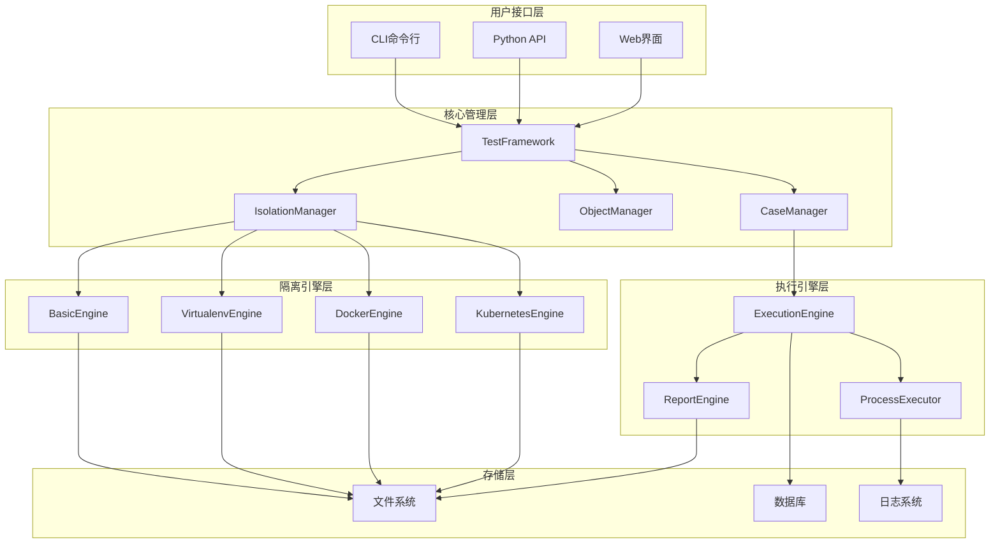
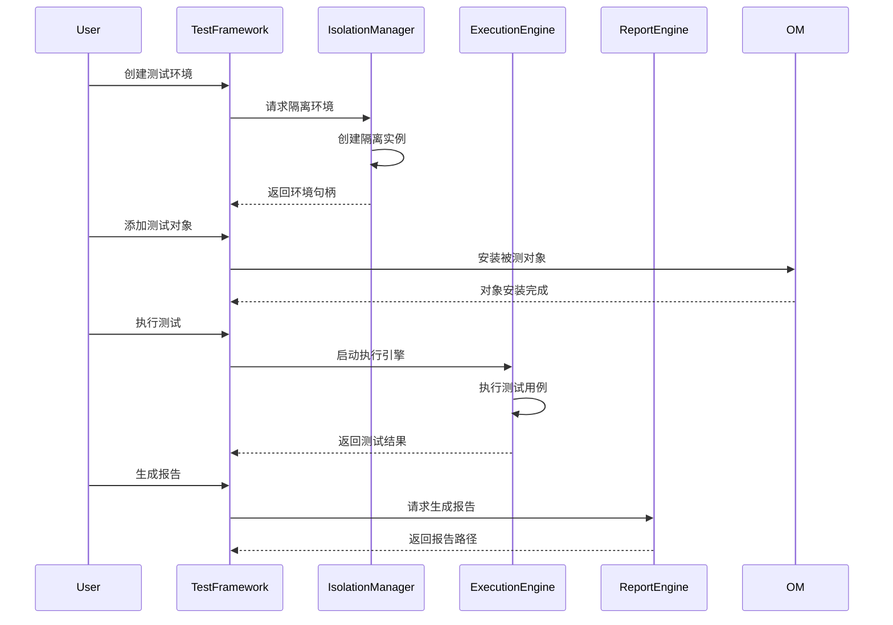

# 系统架构总览

## 🏗️ 架构概述

ptest 是一个企业级的综合测试框架，采用模块化、可扩展的架构设计，支持多种测试类型和环境隔离。

### 核心设计原则

1. **模块化设计**: 每个功能模块职责单一，松耦合
2. **可扩展性**: 支持插件式扩展，自定义组件
3. **隔离性**: 多层次的环境隔离，确保测试独立性
4. **兼容性**: 向后兼容，渐进式升级

## 🧩 系统架构图



## 🏛️ 核心组件架构

### 1. 测试框架核心 (TestFramework)

**职责**:
- 统一的框架入口
- 环境管理协调
- 生命周期管理
- 配置管理

**关键特性**:
- 上下文管理器支持
- 多环境并发管理
- 统一的错误处理
- 事件钩子系统

### 2. 隔离管理系统 (IsolationManager)

**职责**:
- 多级隔离引擎管理
- 环境生命周期控制
- 资源配额管理
- 隔离策略实施

**架构层次**:
```
IsolationManager
├── BasicEngine (基础文件系统隔离)
├── VirtualenvEngine (Python虚拟环境隔离)
├── DockerEngine (容器隔离)
└── KubernetesEngine (集群隔离)
```

### 3. 对象管理系统 (ObjectManager)

**职责**:
- 被测对象生命周期管理
- 依赖关系管理
- 状态监控
- 健康检查

**支持对象类型**:
- 数据库对象 (MySQL, PostgreSQL, MongoDB, SQLite)
- Web服务对象
- API服务对象
- 自定义对象类型

### 4. 测试用例管理系统 (CaseManager)

**职责**:
- 测试用例定义和管理
- 执行计划调度
- 结果收集分析
- 依赖关系处理

## 🔧 隔离架构详解

### 隔离级别层次

| 隔离级别 | 隔离范围 | 适用场景 | 性能开销 |
|---------|---------|---------|----------|
| Basic | 文件系统 | 简单测试 | 低 |
| Virtualenv | Python环境 | 包隔离测试 | 中 |
| Docker | 容器级别 | 完全隔离 | 高 |
| Kubernetes | 集群级别 | 分布式测试 | 很高 |

### 隔离实现策略

```python
# 隔离引擎接口设计
class IsolationEngine(ABC):
    @abstractmethod
    def create_isolation(self, path, env_id, config):
        pass
    
    @abstractmethod
    def cleanup_isolation(self, env):
        pass
    
    @abstractmethod
    def validate_isolation(self, env):
        pass
```

## 📊 数据流架构

### 测试执行流程



## 🗄️ 存储架构

### 目录结构设计

```
ptest_env/
├── objects/          # 被测对象存储
│   ├── mysql/       # MySQL数据库
│   ├── postgresql/  # PostgreSQL数据库
│   └── web/         # Web服务
├── cases/           # 测试用例
├── logs/            # 日志文件
├── reports/         # 测试报告
├── data/            # 测试数据
├── scripts/         # 辅助脚本
└── config/          # 配置文件
```

### 数据持久化策略

1. **配置数据**: JSON格式，支持热重载
2. **日志数据**: 结构化日志，支持查询分析
3. **测试结果**: 多格式支持 (JSON, HTML, XML)
4. **临时数据**: 自动清理策略

## 🔌 插件架构

### 插件扩展点

1. **隔离引擎**: 自定义隔离策略
2. **对象类型**: 新的被测对象类型
3. **执行器**: 自定义测试执行逻辑
4. **报告器**: 自定义报告格式

### 插件注册机制

```python
# 插件注册示例
class CustomIsolationEngine(IsolationEngine):
    def create_isolation(self, path, env_id, config):
        # 自定义隔离实现
        pass

# 注册插件
isolation_manager.register_engine("custom", CustomIsolationEngine)
```

## 🛡️ 安全架构

### 隔离安全策略

1. **文件系统隔离**: 权限控制，访问限制
2. **进程隔离**: 命名空间，资源限制
3. **网络隔离**: 端口隔离，访问控制
4. **资源隔离**: CPU/内存/磁盘配额

### 安全控制机制

- 用户权限管理
- 资源使用监控
- 异常行为检测
- 审计日志记录

## 📈 性能架构

### 性能优化策略

1. **并发执行**: 多环境并行测试
2. **资源复用**: 智能缓存机制
3. **增量更新**: 变更检测和增量处理
4. **懒加载**: 按需初始化

### 性能监控指标

- 环境创建时间
- 测试执行速度
- 内存使用效率
- 资源利用率

## 🔄 事件系统架构

### 事件驱动模型

```python
# 事件类型定义
class IsolationEvent(Enum):
    ENVIRONMENT_CREATING = "environment_creating"
    ENVIRONMENT_CREATED = "environment_created"
    PROCESS_STARTING = "process_starting"
    PROCESS_STOPPED = "process_stopped"
```

### 事件处理机制

- 事件发布订阅
- 异步事件处理
- 事件过滤和路由
- 事件持久化存储

## 🚀 扩展性设计

### 水平扩展

- 分布式执行支持
- 负载均衡机制
- 集群状态同步
- 故障转移机制

### 垂直扩展

- 插件系统支持
- 自定义组件集成
- 配置系统扩展
- API接口扩展

## 📚 技术栈

### 核心技术

- **语言**: Python 3.8+
- **依赖管理**: pip/venv
- **容器化**: Docker/Podman
- **编排**: Kubernetes (可选)

### 关键库

- **虚拟环境**: venv
- **进程管理**: subprocess
- **配置管理**: configparser
- **日志系统**: logging
- **测试框架**: unittest (内置)

### 开发工具

- **代码质量**: pylint, mypy
- **文档生成**: Sphinx
- **测试覆盖**: coverage
- **构建工具**: setuptools

---

**文档版本**: 1.0  
**最后更新**: 2026-01-25  
**作者**: cp