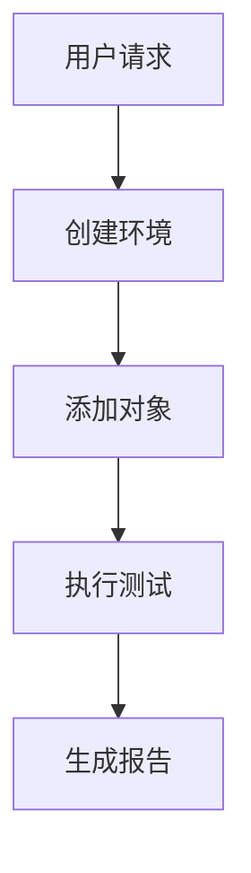

# ptest 开发指南

## 🛠️ 开发概述

本文档为 ptest 框架的开发者提供详细的开发指南，包括代码规范、架构设计、扩展开发和贡献流程。

## 📋 开发环境设置

### 系统要求

- **Python**: 3.8+
- **Git**: 版本控制
- **IDE**: 推荐 VS Code 或 PyCharm
- **测试工具**: pytest 或 unittest (**暂时**)

### 环境配置

```bash
# 克隆项目
git clone https://github.com/your-org/ptest.git
cd ptest

# 创建开发环境
python -m venv venv
source venv/bin/activate  # Linux/macOS
# 或 venv\Scripts\activate  # Windows

# 安装开发依赖
pip install -r requirements-dev.txt
pip install -e .

# 安装pre-commit钩子
pre-commit install
```

### 开发工具配置

#### VS Code 配置

```json
// .vscode/settings.json
{
    "python.defaultInterpreterPath": "./venv/bin/python",
    "python.linting.enabled": true,
    "python.linting.pylintEnabled": true,
    "python.linting.mypyEnabled": true,
    "python.formatting.provider": "black",
    "python.testing.pytestEnabled": true,
    "python.testing.unittestEnabled": true
}
```

#### PyCharm 配置

1. 设置 Python 解释器指向项目虚拟环境
2. 启用代码检查 (Pylint, MyPy)
3. 配置测试运行器
4. 启用代码格式化 (Black)

## 📏 代码规范

### Python 代码风格

遵循 PEP 8 标准，使用以下工具：

```bash
# 代码格式化
black ptest/

# 代码检查
pylint ptest/

# 类型检查
mypy ptest/

# 导入排序
isort ptest/
```

### 命名规范

#### 类名
```python
# 使用 PascalCase
class TestFramework:
    pass

class IsolationManager:
    pass
```

#### 函数和变量名
```python
# 使用 snake_case
def create_environment():
    pass

def get_status():
    pass

isolation_level = "basic"
environment_manager = None
```

#### 常量名
```python
# 使用 UPPER_CASE
DEFAULT_CONFIG = {}
MAX_ENVIRONMENTS = 100
LOG_LEVEL = "INFO"
```

#### 私有成员
```python
class MyClass:
    def __init__(self):
        self._private_var = "private"  # 单下划线：受保护
        self.__private_var = "private"  # 双下划线：私有
    
    def _private_method(self):
        pass
    
    def __private_method(self):
        pass
```

### 文档字符串规范

```python
def create_environment(
    path: str, 
    isolation: str = "basic",
    config: Optional[Dict[str, Any]] = None
) -> TestEnvironment:
    """
    创建测试环境
    
    Args:
        path: 环境路径
        isolation: 隔离级别，默认为 "basic"
        config: 环境配置，可选
    
    Returns:
        TestEnvironment: 创建的测试环境实例
    
    Raises:
        ValueError: 当隔离级别不支持时
        EnvironmentError: 当环境创建失败时
    
    Example:
        >>> env = create_environment("/tmp/test", "virtualenv")
        >>> isinstance(env, TestEnvironment)
        True
    """
    pass
```

## 🏗️ 架构设计

### 模块结构

```
ptest/
├── __init__.py              # 包初始化
├── api.py                   # Python API 接口
├── cli.py                   # 命令行接口
├── config.py                # 配置管理
├── core.py                  # 核心类和枚举
├── environment.py           # 环境管理（旧版）
├── utils.py                 # 工具函数
├── isolation/               # 隔离模块
│   ├── __init__.py
│   ├── base.py             # 抽象基类
│   ├── manager.py          # 隔离管理器
│   ├── enums.py            # 枚举定义
│   ├── basic_engine.py     # 基础隔离引擎
│   ├── virtualenv_engine.py # Virtualenv引擎
│   └── docker_engine.py    # Docker引擎
├── objects/                 # 对象管理
│   ├── __init__.py
│   ├── manager.py          # 对象管理器
│   ├── base.py             # 对象基类
│   ├── db.py               # 数据库对象
│   ├── web.py              # Web对象
│   └── service.py          # 服务对象
├── cases/                   # 测试用例
│   ├── __init__.py
│   ├── manager.py          # 用例管理器
│   ├── executor.py         # 执行引擎
│   └── result.py           # 结果封装
├── reports/                 # 报告生成
│   ├── __init__.py
│   └── generator.py        # 报告生成器
└── tests/                   # 测试代码
    ├── __init__.py
    ├── test_api.py
    ├── test_isolation/
    ├── test_objects/
    └── test_cases/
```

### 设计原则

#### 1. 单一职责原则 (SRP)
每个类和模块只负责一个功能：
- `IsolationManager`: 只负责隔离管理
- `ObjectManager`: 只负责对象管理
- `CaseManager`: 只负责用例管理

#### 2. 开闭原则 (OCP)
对扩展开放，对修改关闭：
- 通过抽象接口支持新的隔离引擎
- 通过插件机制支持新的对象类型
- 通过配置系统支持新的功能

#### 3. 依赖倒置原则 (DIP)
高层模块不依赖低层模块：
- `TestFramework` 依赖 `IsolationEngine` 抽象
- 具体实现通过工厂模式创建

#### 4. 接口隔离原则 (ISP)
客户端不应该依赖它不需要的接口：
- 分离不同的功能接口
- 提供最小化的接口

### 扩展开发

#### 添加新的隔离引擎

1. **创建引擎类**
```python
# isolation/custom_engine.py
from .base import IsolationEngine, IsolatedEnvironment

class CustomEnvironment(IsolatedEnvironment):
    def __init__(self, env_id, path, isolation_engine, config):
        super().__init__(env_id, path, isolation_engine, config)
        # 实现自定义环境逻辑
    
    def activate(self) -> bool:
        # 实现激活逻辑
        pass
    
    def cleanup(self, force: bool = False) -> bool:
        # 实现清理逻辑
        pass

class CustomIsolationEngine(IsolationEngine):
    def __init__(self, config):
        super().__init__(config)
        self.supported_features = ["custom_feature"]
    
    def create_isolation(self, path, env_id, config):
        return CustomEnvironment(env_id, path, self, config)
    
    def cleanup_isolation(self, env):
        return env.cleanup(force=True)
    
    def validate_isolation(self, env):
        return env.validate_isolation()
    
    def get_supported_features(self):
        return self.supported_features.copy()
```

2. **注册引擎**
```python
# 在隔离管理器中注册
from isolation.custom_engine import CustomIsolationEngine

isolation_manager.register_engine("custom", CustomIsolationEngine)
```

#### 添加新的对象类型

1. **创建对象类**
```python
# objects/custom_object.py
from .base import BaseObject

class CustomObject(BaseObject):
    def __init__(self, name, config, env_manager):
        super().__init__(name, config, env_manager)
        self.object_type = "custom"
    
    def install(self) -> str:
        # 实现安装逻辑
        return f"Custom object {self.name} installed"
    
    def start(self) -> str:
        # 实现启动逻辑
        return f"Custom object {self.name} started"
    
    def stop(self) -> str:
        # 实现停止逻辑
        return f"Custom object {self.name} stopped"
    
    def health_check(self) -> str:
        # 实现健康检查
        return f"Custom object {self.name} is healthy"
```

2. **注册对象类型**
```python
# 在对象管理器中注册
from objects.custom_object import CustomObject

object_manager.register_object_type("custom", CustomObject)
```

## 🧪 测试开发

### 测试策略

#### 1. 单元测试
- 测试单个函数或方法
- 使用 mock 隔离外部依赖
- 覆盖正常情况和异常情况

#### 2. 集成测试
- 测试模块间的交互
- 测试完整的业务流程
- 使用真实的依赖

#### 3. 端到端测试
- 测试完整的用户场景
- 使用真实的运行环境
- 验证系统整体功能

### 测试编写规范

#### 测试文件命名
```bash
# 单元测试
test_isolation_manager.py
test_basic_engine.py

# 集成测试
test_isolation_integration.py
test_api_integration.py

# 端到端测试
test_e2e_scenarios.py
```

#### 测试类命名
```python
class TestIsolationManager(unittest.TestCase):
    pass

class TestBasicIsolationEngine(unittest.TestCase):
    pass
```

#### 测试方法命名
```python
def test_create_environment_success(self):
    pass

def test_create_environment_with_invalid_isolation(self):
    pass

def test_cleanup_environment_force(self):
    pass
```

#### 测试结构
```python
import unittest
from unittest.mock import Mock, patch
from isolation.manager import IsolationManager

class TestIsolationManager(unittest.TestCase):
    def setUp(self):
        """测试前准备"""
        self.config = {"max_environments": 5}
        self.manager = IsolationManager(self.config)
    
    def tearDown(self):
        """测试后清理"""
        self.manager.cleanup_all_environments(force=True)
    
    def test_create_environment_success(self):
        """测试成功创建环境"""
        # Arrange
        test_path = "/tmp/test_env"
        
        # Act
        env = self.manager.create_environment(test_path, "basic")
        
        # Assert
        self.assertIsNotNone(env)
        self.assertEqual(env.env_id, self.manager.list_environments()[list(self.manager.list_environments().keys())[0]]["env_id"])
    
    @patch('isolation.basic_engine.BasicEnvironment')
    def test_create_environment_with_mock(self, mock_env):
        """测试使用mock创建环境"""
        # Arrange
        mock_env.return_value.activate.return_value = True
        test_path = "/tmp/test_env"
        
        # Act
        env = self.manager.create_environment(test_path, "basic")
        
        # Assert
        mock_env.assert_called_once()
        self.assertIsNotNone(env)
```

### 测试覆盖率

```bash
# 运行测试并生成覆盖率报告
pytest --cov=ptest --cov-report=html tests/

# 检查覆盖率
coverage report -m

# 查看详细报告
open htmlcov/index.html
```

### 性能测试

```python
import time
import unittest
from isolation.manager import IsolationManager

class TestPerformance(unittest.TestCase):
    def test_environment_creation_performance(self):
        """测试环境创建性能"""
        manager = IsolationManager()
        
        start_time = time.time()
        
        # 创建100个环境
        for i in range(100):
            env = manager.create_environment(f"/tmp/test_{i}", "basic")
        
        end_time = time.time()
        duration = end_time - start_time
        
        # 验证性能要求（每个环境创建时间 < 0.1秒）
        avg_time = duration / 100
        self.assertLess(avg_time, 0.1, f"Average creation time {avg_time:.3f}s exceeds 0.1s")
        
        manager.cleanup_all_environments(force=True)
```

## 🔄 持续集成

### GitHub Actions 配置

```yaml
# .github/workflows/ci.yml
name: CI

on:
  push:
    branches: [ main, develop ]
  pull_request:
    branches: [ main ]

jobs:
  test:
    runs-on: ubuntu-latest
    strategy:
      matrix:
        python-version: [3.8, 3.9, 3.10, 3.11]

    steps:
    - uses: actions/checkout@v3
    
    - name: Set up Python ${{ matrix.python-version }}
      uses: actions/setup-python@v3
      with:
        python-version: ${{ matrix.python-version }}
    
    - name: Install dependencies
      run: |
        python -m pip install --upgrade pip
        pip install -r requirements-dev.txt
    
    - name: Lint with pylint
      run: |
        pylint ptest/
    
    - name: Type check with mypy
      run: |
        mypy ptest/
    
    - name: Test with pytest
      run: |
        pytest --cov=ptest --cov-report=xml
    
    - name: Upload coverage to Codecov
      uses: codecov/codecov-action@v3
```

### Pre-commit 钩子

```yaml
# .pre-commit-config.yaml
repos:
  - repo: https://github.com/psf/black
    rev: 22.3.0
    hooks:
      - id: black
        language_version: python3

  - repo: https://github.com/pycqa/isort
    rev: 5.10.1
    hooks:
      - id: isort

  - repo: https://github.com/pycqa/pylint
    rev: v2.14.0
    hooks:
      - id: pylint
        args: [--disable=C0114,C0115,C0116]

  - repo: https://github.com/pre-commit/mirrors-mypy
    rev: v0.950
    hooks:
      - id: mypy
        additional_dependencies: [types-all]
```

## 📝 文档开发

### 文档类型

1. **API文档**: 自动生成，包含所有公共接口
2. **用户指南**: 面向最终用户的使用说明
3. **开发文档**: 面向开发者的技术文档
4. **架构文档**: 系统设计和架构说明

### 文档编写规范

#### Markdown 格式
- 使用标准 Markdown 语法
- 添加适当的目录和导航
- 包含代码示例和图表

#### 代码示例
```python
# 在文档中包含可运行的代码示例
from ptest import TestFramework

# 创建框架实例
framework = TestFramework()

# 创建测试环境
env = framework.create_environment("./test_env", isolation="virtualenv")
```

#### 图表和流程图


### 文档生成

```bash
# 生成API文档
sphinx-build -b html docs/source docs/build

# 生成覆盖率报告
pytest --cov=ptest --cov-report=html

# 生成文档统计
sphx-gallery -n -o docs/examples
```

## 🤝 贡献流程

### 分支策略

- `main`: 主分支，稳定版本
- `develop`: 开发分支，集成最新功能
- `feature/*`: 功能分支，开发新功能
- `bugfix/*`: 修复分支，修复bug
- `release/*`: 发布分支，准备发布

### 提交规范

#### 提交消息格式
```
<type>(<scope>): <subject>

<body>

<footer>
```

#### 类型 (type)
- `feat`: 新功能
- `fix`: 修复bug
- `docs`: 文档更新
- `style`: 代码格式调整
- `refactor`: 代码重构
- `test`: 测试相关
- `chore`: 构建工具或辅助工具的变动

#### 示例
```
feat(isolation): add docker isolation engine

- Implement DockerIsolationEngine class
- Add DockerEnvironment for container management
- Support resource limits and network isolation
- Add comprehensive tests

Closes #123
```

### Pull Request 流程

1. **创建分支**
```bash
git checkout -b feature/new-isolation-engine
```

2. **开发和测试**
```bash
# 编写代码
# 编写测试
# 运行测试
pytest tests/
```

3. **提交代码**
```bash
git add .
git commit -m "feat(isolation): add docker isolation engine"
git push origin feature/new-isolation-engine
```

4. **创建 Pull Request**
- 填写 PR 模板
- 关联相关 Issue
- 请求代码审查

5. **代码审查**
- 至少一个审查者批准
- 通过所有自动化检查
- 解决审查意见

6. **合并代码**
```bash
git checkout develop
git merge feature/new-isolation-engine
git push origin develop
```

## 🔧 调试和故障排除

### 调试技巧

#### 1. 日志调试
```python
import logging
logging.getLogger("ptest").setLevel(logging.DEBUG)

# 或在代码中添加日志
logger = logging.getLogger(__name__)
logger.debug("Debug message")
logger.info("Info message")
logger.error("Error message")
```

#### 2. 断点调试
```python
import pdb

def debug_function():
    pdb.set_trace()  # 设置断点
    # 调试代码
```

#### 3. 异常处理
```python
try:
    # 可能出错的代码
    pass
except Exception as e:
    logger.error(f"Error occurred: {e}", exc_info=True)
    raise
```

### 常见问题

#### 1. 导入错误
```python
# 检查 PYTHONPATH
import sys
print(sys.path)

# 检查模块安装
pip list | grep ptest
```

#### 2. 配置问题
```python
# 检查配置文件
from ptest.config import DEFAULT_CONFIG
print(DEFAULT_CONFIG)
```

#### 3. 环境问题
```python
# 检查环境变量
import os
print(os.environ.get("PYTHONPATH"))
```

## 📚 学习资源

### 推荐书籍
- 《Clean Code》- 代码整洁之道
- 《Design Patterns》- 设计模式
- 《Effective Python》- Python高效编程

### 在线资源
- [Python 官方文档](https://docs.python.org/)
- [PEP 8 风格指南](https://pep8.org/)
- [pytest 文档](https://docs.pytest.org/)

### 社区
- [GitHub Discussions](https://github.com/wu-champion/ptest/discussions)
- [Stack Overflow](https://stackoverflow.com/questions/tagged/ptest)
- [开发者邮件列表](mailto:dev@ptest.org)

---

**文档版本**: 1.0  
**最后更新**: 2026-01-25  
**维护者**: cp