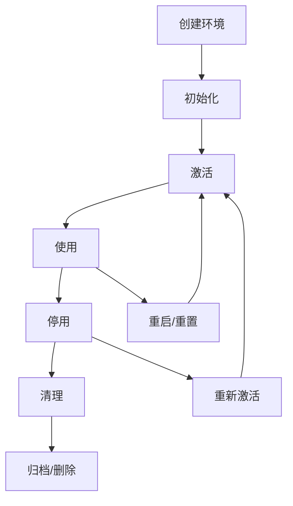

# 环境管理指南

## 🏗️ 环境管理概述

ptest 的环境管理功能提供了企业级的多层次环境隔离能力，确保测试环境之间的完全独立性和安全性。

## 🎯 隔离级别

### Basic 隔离
**适用场景**: 简单的单元测试、基础功能验证

**特性**:
- 文件系统目录隔离
- 基础进程管理
- 端口分配和冲突检测
- 最小资源开销

**使用示例**:
```python
from ptest import TestFramework

framework = TestFramework()
env = framework.create_environment("./test_env", isolation="basic")
```

### Virtualenv 隔离
**适用场景**: Python应用测试、包依赖隔离

**特性**:
- Python虚拟环境完全隔离
- 包依赖管理和版本控制
- 独立的Python解释器
- 支持requirements.txt

**使用示例**:
```python
# 创建虚拟环境隔离
env = framework.create_environment("./python_test", isolation="virtualenv")

# 安装特定版本的包
env.install_package("requests==2.28.0")
env.install_package("pandas==1.5.0")

# 安装从requirements.txt
env.install_packages_from_requirements("requirements.txt")

# 查看已安装的包
packages = env.get_installed_packages()
print(packages)  # {'requests': '2.28.0', 'pandas': '1.5.0'}
```

### Docker 隔离
**适用场景**: 集成测试、完整环境隔离、微服务测试

**特性**:
- 完整的容器环境隔离
- 操作系统级别的隔离
- 资源限制和配额管理
- 网络隔离和安全控制

**使用示例**:
```python
# 创建Docker隔离环境
env = framework.create_environment("./integration_test", isolation="docker", 
                                  env_config={
                                      "image": "python:3.9-slim",
                                      "resource_limits": {
                                          "memory_limit": "1g",
                                          "cpu_limit": 2.0
                                      },
                                      "network_config": {
                                          "port_mapping": {"8080": "8080"},
                                          "network_isolation": True
                                      }
                                  })

# 在容器中执行命令
result = env.execute_in_isolation(["python", "--version"])
print(result.stdout)  # Python 3.9.x
```

## 🔧 环境管理操作

### 创建环境

```python
# 基础创建
env = framework.create_environment(path="./test_env")

# 指定隔离级别
env = framework.create_environment(
    path="./test_env",
    isolation="virtualenv",
    name="my_test_env"
)

# 使用自定义配置
env = framework.create_environment(
    path="./test_env",
    isolation="virtualenv",
    env_config={
        "python_version": "3.9",
        "base_packages": ["setuptools", "wheel", "pip"],
        "requirements": ["requests==2.28.0", "pytest==7.0.0"],
        "resource_limits": {
            "memory_mb": 1024,
            "max_processes": 50
        }
    }
)
```

### 环境状态管理

```python
# 获取环境状态
status = env.get_status()
print(f"环境状态: {status['status']}")
print(f"创建时间: {status['created_at']}")
print(f"隔离类型: {status['isolation_type']}")

# 激活环境（如果需要）
success = env.activate()

# 停用环境
success = env.deactivate()
```

### 资源管理

```python
# 获取资源使用情况
resource_usage = env.get_resource_usage()
print(f"CPU使用率: {resource_usage['cpu_percent']}%")
print(f"内存使用: {resource_usage['memory_mb']}MB")
print(f"磁盘使用: {resource_usage['disk_mb']}MB")

# 获取分配的端口
ports = env.allocated_ports
print(f"已分配端口: {ports}")

# 分配新端口
new_port = env.allocate_port()
print(f"新分配端口: {new_port}")

# 释放端口
success = env.release_port(new_port)
```

### 环境清理

```python
# 清理环境（保留文件结构）
env.cleanup()

# 强制清理（删除所有文件）
env.cleanup(force=True)

# 通过管理器清理
framework.cleanup_environment(env.env_id)
framework.cleanup_all_environments(force=True)
```

## 🔄 环境生命周期

### 生命周期阶段



### 生命周期管理示例

```python
from ptest import TestFramework

# 使用上下文管理器确保资源清理
with TestFramework() as framework:
    env = framework.create_environment("./lifecycle_test", isolation="virtualenv")
    
    # 环境会自动激活
    with env:
        # 在环境中执行操作
        mysql = env.add_object("mysql", "test_db", version="8.0")
        mysql.start()
        
        # 添加和运行测试
        env.add_case("db_test", {
            "type": "database",
            "object": "test_db",
            "query": "SELECT 1"
        })
        
        result = env.run_case("db_test")
        print(f"测试结果: {'通过' if result.is_passed() else '失败'}")
    
    # 环境自动停用
# 框架自动清理所有资源
```

## 📦 包管理 (Virtualenv隔离)

### 包安装

```python
# 安装单个包
success = env.install_package("requests==2.28.0")

# 安装多个包
packages = [
    ("requests", "2.28.0"),
    ("pandas", "1.5.0"),
    ("numpy", "1.24.0")
]

for package, version in packages:
    env.install_package(package, version)

# 从requirements.txt安装
env.install_from_requirements("requirements.txt")

# 升级包
env.upgrade_package("requests")
```

### 包查询

```python
# 获取所有已安装包
packages = env.get_installed_packages()
for name, version in packages.items():
    print(f"{name}: {version}")

# 获取特定包版本
version = env.get_package_version("requests")
print(f"requests版本: {version}")

# 检查包是否安装
is_installed = env.is_package_installed("requests")
print(f"requests已安装: {is_installed}")
```

### 包卸载

```python
# 卸载单个包
success = env.uninstall_package("requests")

# 卸载多个包
for package in ["requests", "pandas"]:
    env.uninstall_package(package)

# 清理未使用的包
env.cleanup_unused_packages()
```

## 🌐 网络管理

### 端口管理

```python
# 分配端口范围
env.configure_port_range(start_port=20000, end_port=21000)

# 分配单个端口
port1 = env.allocate_port()
port2 = env.allocate_port()

# 检查端口可用性
is_available = env.is_port_available(8080)

# 释放端口
env.release_port(port1)
env.release_port(port2)
```

### 网络隔离

```python
# 配置网络隔离
env.configure_network_isolation(
    enabled=True,
    allowed_hosts=["localhost", "127.0.0.1"],
    blocked_ports=[22, 3389],
    firewall_rules=[
        {"action": "allow", "port": 8080, "protocol": "tcp"},
        {"action": "deny", "port": 22, "protocol": "tcp"}
    ]
)

# 测试网络连接
result = env.execute_in_isolation(["curl", "http://example.com"])
if result.returncode != 0:
    print("网络访问被阻止")
```

## 🔒 安全配置

### 权限控制

```python
# 配置文件权限
env.configure_file_permissions({
    "/logs": "read_write",
    "/data": "read_write", 
    "/bin": "read_only",
    "/lib": "read_only"
})

# 配置执行权限
env.configure_execute_permissions({
    "allow_python": True,
    "allow_shell": False,
    "allow_network": True,
    "allow_file_access": "restricted"
})
```

### 资源限制

```python
# 设置CPU限制
env.set_cpu_limit(cores=2, percentage=80.0)

# 设置内存限制
env.set_memory_limit(hard_limit="2g", soft_limit="1.5g")

# 设置磁盘限制
env.set_disk_limit(max_size="10g", max_files=1000)

# 设置进程限制
env.set_process_limit(max_processes=50, max_threads=200)
```

## 📊 监控和日志

### 环境监控

```python
# 启用监控
env.enable_monitoring(
    cpu_usage=True,
    memory_usage=True,
    disk_usage=True,
    network_usage=True,
    interval=5  # 5秒采样间隔
)

# 获取监控数据
monitoring_data = env.get_monitoring_data()
print(f"平均CPU使用率: {monitoring_data['cpu']['average']:.2f}%")
print(f"平均内存使用: {monitoring_data['memory']['average']:.2f}MB")

# 获取监控报告
report = env.generate_monitoring_report(format="json")
```

### 日志管理

```python
# 配置日志
env.configure_logging(
    level="INFO",
    format="%(asctime)s - %(name)s - %(levelname)s - %(message)s",
    handlers=["file", "console"],
    max_file_size="10MB",
    backup_count=5
)

# 获取日志
logs = env.get_logs(level="ERROR", lines=100)
for log in logs:
    print(log)

# 导出日志
env.export_logs("/path/to/logs.tar.gz")
```

## 🔄 环境模板

### 创建模板

```python
# 从现有环境创建模板
template_id = env.create_template(
    name="python_web_template",
    description="Python Web应用测试模板",
    include_packages=True,
    include_config=True,
    include_objects=False
)

# 手动创建模板
template = framework.create_environment_template(
    name="database_template",
    isolation="virtualenv",
    packages=["mysql-connector-python==8.0.0", "pytest==7.0.0"],
    config={
        "python_version": "3.9",
        "resource_limits": {
            "memory_mb": 1024
        }
    },
    objects=[
        {"type": "mysql", "name": "test_db", "version": "8.0"}
    ]
)
```

### 使用模板

```python
# 从模板创建环境
env = framework.create_environment_from_template(
    template_id="python_web_template",
    path="./web_test_env",
    custom_config={
        "resource_limits": {
            "memory_mb": 2048
        }
    }
)

# 列出可用模板
templates = framework.list_environment_templates()
for template in templates:
    print(f"{template['name']}: {template['description']}")
```

## 🚀 性能优化

### 环境复用

```python
# 启用环境复用
framework.enable_environment_reuse(max_reuse_count=5)

# 创建可复用环境
env = framework.create_reusable_environment(
    path="./reusable_env",
    isolation="virtualenv",
    reuse_key="python_base"
)

# 清理复用环境
framework.cleanup_reusable_environments(older_than_days=7)
```

### 预热机制

```python
# 预热常用环境类型
framework.prewarm_environments([
    {"isolation": "virtualenv", "packages": ["requests", "pytest"]},
    {"isolation": "virtualenv", "packages": ["pandas", "numpy"]},
    {"isolation": "docker", "image": "python:3.9-slim"}
])

# 获取预热环境状态
prewarm_status = framework.get_prewarm_status()
```

### 缓存策略

```python
# 配置缓存策略
framework.configure_cache({
    "package_cache": {
        "enabled": True,
        "max_size": "1GB",
        "ttl": "7d"
    },
    "image_cache": {
        "enabled": True,
        "max_count": 10,
        "cleanup_policy": "lru"
    }
})
```

## 🛠️ 故障排除

### 常见问题

#### 环境创建失败
```bash
# 检查磁盘空间
df -h

# 检查权限
ls -la /path/to/env

# 检查Python环境
python --version
which python
```

#### Virtualenv创建失败
```python
# 诊断virtualenv问题
import venv
import sys

print(f"Python版本: {sys.version}")
print(f"venv模块可用: {hasattr(venv, 'EnvBuilder')}")

# 尝试手动创建
try:
    venv.EnvBuilder(with_pip=True).create("/tmp/test_venv")
    print("Virtualenv创建成功")
except Exception as e:
    print(f"Virtualenv创建失败: {e}")
```

#### Docker环境问题
```bash
# 检查Docker状态
docker --version
docker info

# 检查镜像
docker images python:3.9-slim

# 清理Docker资源
docker system prune -f
```

### 调试技巧

#### 启用详细日志
```python
import logging

# 启用ptest调试日志
logging.getLogger("ptest").setLevel(logging.DEBUG)

# 启用环境调试日志
env.enable_debug_logging()

# 查看环境创建日志
creation_logs = env.get_creation_logs()
print(creation_logs)
```

#### 环境验证
```python
# 验证环境完整性
validation_result = env.validate_environment()
if not validation_result.is_valid:
    print(f"环境验证失败: {validation_result.errors}")
    for error in validation_result.errors:
        print(f"  - {error}")

# 修复环境问题
if not validation_result.is_valid:
    repair_result = env.repair_environment()
    print(f"修复结果: {repair_result.success}")
```

## 📚 最佳实践

### 环境命名
```python
# 使用描述性的环境名称
env_names = [
    "api_test_env_v1",           # API测试环境v1
    "db_integration_mysql80",     # MySQL 8.0集成测试
    "web_e2e_chrome_latest",    # 最新Chrome的E2E测试
    "performance_load_test_10x"  # 10倍负载的性能测试
]
```

### 资源管理
```python
# 根据测试类型配置合适的资源
test_configs = {
    "unit_test": {
        "isolation": "basic",
        "resource_limits": {"memory_mb": 256, "max_processes": 10}
    },
    "integration_test": {
        "isolation": "virtualenv", 
        "resource_limits": {"memory_mb": 512, "max_processes": 25}
    },
    "e2e_test": {
        "isolation": "docker",
        "resource_limits": {"memory_mb": 1024, "max_processes": 50}
    }
}
```

### 清理策略
```python
# 自动清理策略
framework.configure_auto_cleanup({
    "enabled": True,
    "idle_timeout": 3600,        # 1小时未使用自动清理
    "max_age_days": 7,          # 7天后强制清理
    "cleanup_policy": "soft"     # 软清理，保留重要环境
})
```

---

## 🔗 相关文档

- [系统架构总览](../architecture/system-overview.md)
- [环境隔离架构](../architecture/environment-isolation.md)
- [API 参考](../api/python-api.md)
- [测试用例编写](test-case-writing.md)
- [对象管理指南](object-management.md)

---

**文档版本**: 1.0  
**最后更新**: 2026-01-25  
**维护者**: cp